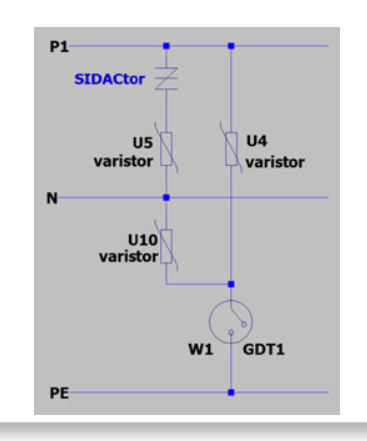
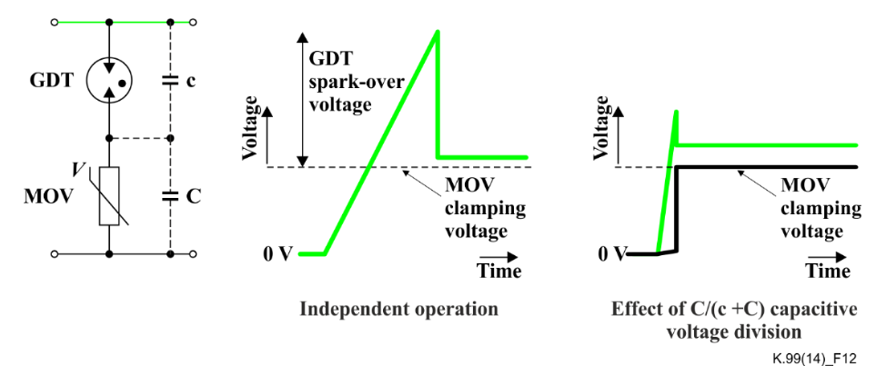
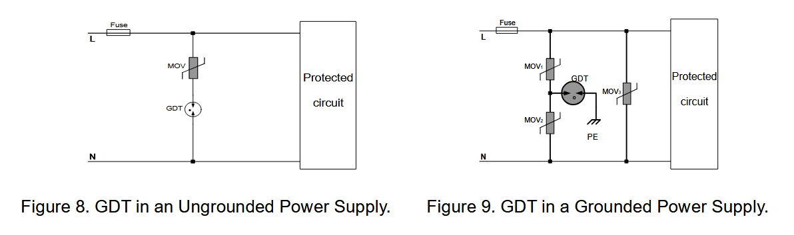
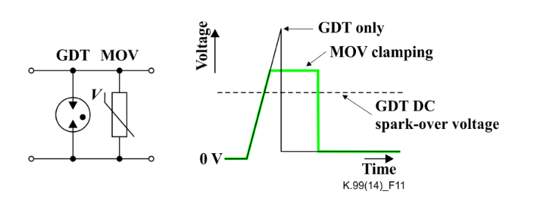
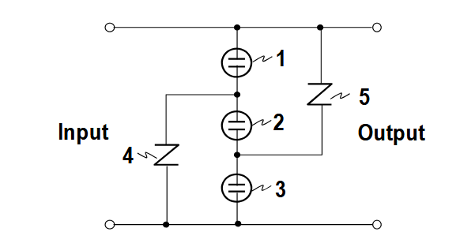
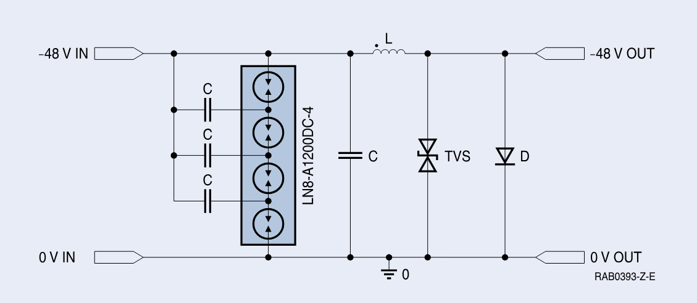

# Determining optimal protection
## Standard [IEC 61000-4-5](https://rtpcorp.com/wp-content/uploads/2021/04/IEC61000-4-5.pdf)
* 1.2µs/50µs open-circuit voltage waveform
* 8/20µs short-circuit current waveform

### Coupling capacitance
* Line-to-line coupling : 18µF in series with 2Ω -> Iout = Vout/2Ω.  So for a 6kV pulse, Iout = 3kA.
* Line-to-ground coupling : 9µF in series with 12Ω -> Iout = Vout/12Ω.  So for a 6kV pulse, Iout = 500A.

## Hybrid protection
### GDT-MOV series hybrid
<table>
    <tr>
        <td>
            <figure>
                
                <figcaption><a href="./resources/Littelfuse_surge_selection.pdf">How to Select the Optimum Transient Surge Protection for EV On-Board Chargers</a></figcaption>
            </figure>
            <figure>
                
                <figcaption>GDT-MOV series hybrid</figcaption>
            </figure>
            <figure>
                
                <figcaption>GDT-MOV series hybrid with and without protective earth</figcaption>
            </figure>
        </td>
        <td>
            GDT to earth instead of MOV to <b>avoid leakage current</b> which would cause HIPOT-testing to fail. 
            One would expect that only when the voltage across the combination equals the sum of the GDT glow voltage and the MOV clamp voltage can the GDT switch into the arc mode.  However, this series combination will trigger at a voltage lower than the sum of the individual voltages due to capacitive voltage division.  
            The clamping voltage of the series combination is close to the clamping voltage of the MOV for the duration of the surge event. 
            Bourns sells these as combination devices: GMov® Hybrid Surge Arresters (GDT + MOV) and Isomov® Hybrid Surge Arresters (GDT + MOV) 
        </td>
    </tr>
</table>

### GDT-MOV parallel hybrid 
<figure>
    
    <figcaption>GDT-MOV parallel hybrid</figcaption>
</figure>

1. GDT in parallel with MOV for surge protection (see ITU-T K.99, §8.5.1). The MOV clamping voltage must be chosen so that it is never below the GDT d.c. spark-over voltage, otherwise GDT operation would be prevented and the MOV would be subjected to the full surge and possibly fail.
2. Use MOV instead of TVS diode to reduce capacitance on high-speed data lines.
3. Leakage current might be an issue.
4. The resulting voltage is the arcing voltage of the GDT, which is lower than the clamping voltage of the MOV.

### 3-GDT, 2-MOV protection
[Lightning Surge Response Improvement by Combinations of Varistors and Gas Discharge Tubes](https://www.wseas.org/multimedia/journals/power/2012/54-510.pdf)
<figure>
    
    <figcaption>3-GDT, 2-MOV protection</figcaption>
</figure>

* No leakage current path to ground during normal operation
* No effect on PLC-communication lines, because TVS always has a GDT in series.
* symmetrical protection
* High lightning surge current capability, because almost the entire current flow through the GDTs, a problem of life of varistors due to heating does not arise.
* Both follow current interrupt and short circuit current capability can be solved, because we can set the overall arcing voltage higher than that of
commercial power supply by increasing the number of GDTs in series.

## Advantages and disadvantages of GDTs and MOVs
### Disadvantages of GDTs
<figure>
    
    <figcaption>GDT stacking to avoid follow-on current</figcaption>
</figure>

Follow-on current : For DC applications with input voltage > 20V or AC-mains lines, when a surge is applied, the GDT will continue to conduct.  You always need an element in series to stop the follow-on current.  This can be:
* fuse
* stacked GDTs (multiple GDTs in series with capacitors), especially for DC-applications.
* MOV in series with the GDT (combination devices exist Bourns).  MOV should have significantly lower clamping voltage than the GDT but higher than the arc and glow voltage of the GDT.  In this conducting condition, the combination limiting voltage will be approximately the MOV clamping voltage.

### Disadvantages of MOVs
* leakage current increases over time when subjected to a bias voltage as well as variations in temperature.  It ends with thermal runaway.
* clamping voltage increases with current

### Advantages of MOVs:
* lower capacitance than TVS diodes

# References
* [How to Select the Optimum Transient Surge Protection for EV On-Board Chargers](https://m.littelfuse.com/media?resourcetype=application-notes&itemid=a12f2475-d207-4f54-a7d6-01c4d6eb435c&filename=how-to-select-the-optimum-transient-surge-protection-for-ev-on-board-chargers-application-note)
* [Bourns : Designing Effective Surge Protection for AC and DC Powered Systems](https://www.bourns.com/docs/technical-documents/technical-library/isomov/application-notes/Surge_Protection_for_AC_and_DC_Powered_Systems_appnote.pdf)
* [Product Profile 2025 Surge Arresters and Switching Spark Gaps](https://www.tdk-electronics.tdk.com/download/174146/2f5abeca101a09c264a07fd6ede44414/surge-arresters-pp.pdf)
* [Rec. ITU-T K.99 (07/2017) : Surge protective component application guide – Gas discharge tubes](./resources/T-REC-K.99-201707-I!!PDF-E.pdf)
* [Protecting Circuit Board Power Inputs from Surge Events](https://youtu.be/AGQJwkI6CHc)