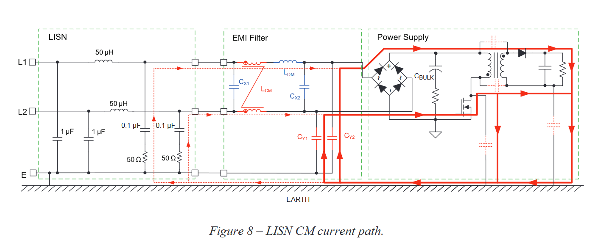

# Application note
* [Wuerth ANP015](https://www.we-online.com/components/media/o109029v410%20AppNotes_ANP015_MainFilterTheLastBarrierInASMPS_EN.pdf)

[FesZ: EMC tutorials - CM/DM filters](https://www.youtube.com/watch?v=lZUXPiDt89I)
CM-noise : 
* noise source has high impedance (because of capacitive coupling to PE in case of double insulated equipment) : Pi filter is used to reduce the noise
* low load impedance : 25ohm load impedance of LISN

DM-noise :
* noise source has low source impedance : T filter is used to reduce the noise
* high load impedance : 100ohm load impedance of LISN

# Filter topology

1. Y-caps (CY1, CY2) : close to the noise source to keep that loop small
2. DM-filter : CX1, Ldm, CX2
3. Final X-cap (CX1) : close to the device terminals.  This will equalize (and share) the CM-currents in L1 and L2.  CX1 avoids that Ldm worsens the CM-noise, see [EMC-tutorials CM/DM filters](https://youtu.be/lZUXPiDt89I?t=841)
